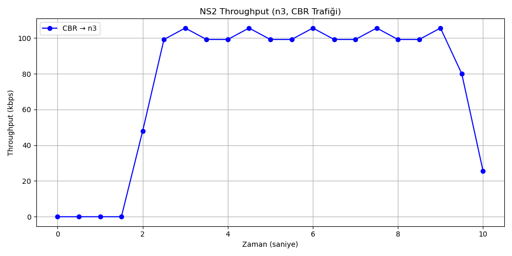

# NS-2 Network Simulation and Throughput Analysis

Bu proje, NS-2 kullanılarak oluşturulan bir ağ topolojisi üzerinde TCP ve UDP trafiklerinin simüle edilmesi ve elde edilen çıktıların Python ile analiz edilmesi amacıyla geliştirilmiştir.

Projede ağ üzerindeki veri akışları gözlemlenmiş, belirli bir düğüm için throughput değerleri hesaplanmış ve sonuçlar grafik üzerinde görselleştirilmiştir.

## Projenin Amacı

Bu çalışmanın amacı bilgisayar ağlarında kullanılan temel trafik türlerini, ağ topolojisini ve veri iletim davranışlarını simülasyon ortamında incelemektir.

NS-2 kullanılarak oluşturulan ağ üzerinde TCP ve UDP bağlantıları tanımlanmış, simülasyon sonucunda oluşan trace dosyası Python ile analiz edilmiştir.

Bu sayede ağ performansının ölçülmesi ve throughput değerlerinin zamana göre değişiminin incelenmesi amaçlanmıştır.

## Özellikler

- NS-2 ile ağ topolojisi oluşturma
- Birden fazla ağ düğümü kullanma
- TCP bağlantılarının modellenmesi
- UDP bağlantılarının modellenmesi
- FTP trafiği oluşturma
- CBR trafiği oluşturma
- Ağ bağlantılarının gecikme ve bant genişliği değerlerinin tanımlanması
- Simülasyon çıktılarının trace dosyasına kaydedilmesi
- NAM ile ağ simülasyonunun görselleştirilmesi
- Python ile trace dosyası analizi
- Throughput hesaplama
- Throughput sonuçlarının grafik üzerinde gösterilmesi

## Kullanılan Teknolojiler

- NS-2
- TCL
- Python
- Matplotlib
- TCP
- UDP
- FTP
- CBR
- Network Simulation
- Throughput Analysis

## Ağ Topolojisi

Projede 9 düğümden oluşan bir ağ topolojisi kullanılmıştır.

NS-2 üzerinde düğümler arasında farklı bant genişliği ve gecikme değerlerine sahip bağlantılar oluşturulmuştur.

Ağ üzerindeki farklı düğümler arasında TCP ve UDP trafik akışları tanımlanarak simülasyon gerçekleştirilmiştir.

## TCP Trafiği

TCP bağlantıları güvenilir veri iletimini modellemek amacıyla kullanılmıştır.

TCP ajanları belirli düğümlere bağlanmış ve veri üretimi için FTP uygulamaları kullanılmıştır.

Bu trafik sayesinde TCP bağlantılarının ağ üzerindeki davranışı gözlemlenmiştir.

## UDP Trafiği

UDP bağlantıları için UDP ajanları kullanılmıştır.

Veri üretmek amacıyla CBR (Constant Bit Rate) trafik kaynakları tanımlanmıştır.

CBR sayesinde belirli bir hızda sürekli veri gönderimi gerçekleştirilmiştir.

## Simülasyon Çıktıları

NS-2 simülasyonu sonucunda çeşitli çıktı dosyaları oluşturulmaktadır.

Bunlardan bazıları:

- `out.tr` — Ağ üzerindeki paket hareketlerinin bulunduğu trace dosyası
- `out.nam` — NAM aracında kullanılan ağ animasyon dosyası

Bu dosyalar simülasyon çalıştırıldığında yeniden üretilebildiği için GitHub reposuna dahil edilmemiştir.

## Throughput Analizi

Simülasyon sonucunda oluşan trace dosyası Python kullanılarak analiz edilmektedir.

`analiz.py` dosyası içerisinde paket bilgileri okunarak belirli bir düğüm için zaman aralıklarına göre alınan veri miktarı hesaplanmaktadır.

Throughput temel olarak:

    Throughput = Alınan Veri Miktarı / Zaman

mantığı ile hesaplanmaktadır.

Elde edilen sonuçlar zamana göre grafik üzerinde gösterilmektedir.

## Grafik

Projede yapılan throughput analizinin örnek çıktısı aşağıda gösterilmektedir:

Grafik, seçilen düğümün simülasyon boyunca sahip olduğu throughput değişimini göstermektedir.

## Proje Dosyaları

- `odev.tcl` — NS-2 ağ topolojisi ve trafik senaryolarının bulunduğu ana simülasyon dosyası
- `analiz.py` — Trace dosyasını analiz ederek throughput hesaplayan Python kodu
- `throughput_n3.png` — Throughput analizinin grafik çıktısı
- `README.md` — Proje açıklamaları

## Çalıştırma

NS-2 kurulu bir ortamda simülasyonu çalıştırmak için:

    ns odev.tcl

komutu kullanılabilir.

Simülasyon sonucunda `out.tr` ve `out.nam` dosyaları oluşturulur.

Trace dosyasını analiz etmek için:

    python analiz.py

komutu çalıştırılabilir.

Analiz sonucunda throughput değerleri hesaplanır ve grafik oluşturulur.

## Öğrenilen Kavramlar

Bu proje kapsamında aşağıdaki bilgisayar ağları kavramları uygulamalı olarak kullanılmıştır:

- Network Topology
- TCP
- UDP
- FTP
- CBR
- Bandwidth
- Delay
- Packet Transmission
- Trace Analysis
- Throughput
- Network Simulation

## Proje Notu

Bu proje Bilgisayar Ağları dersi kapsamında geliştirilmiş akademik bir çalışmadır.
